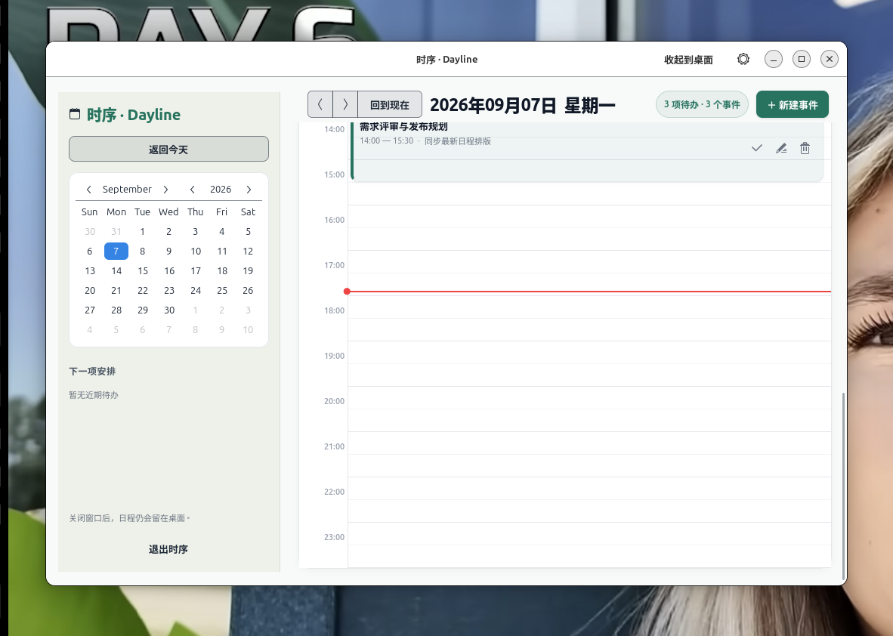
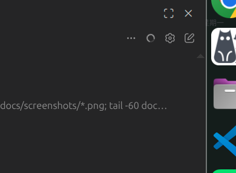
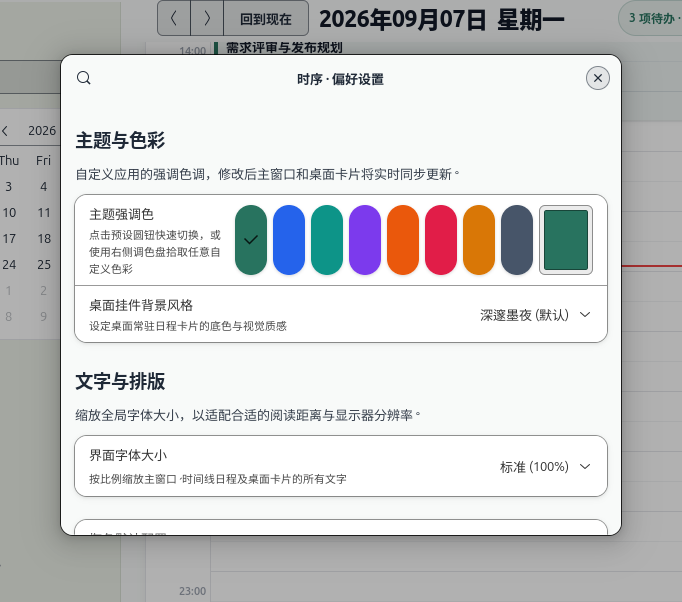
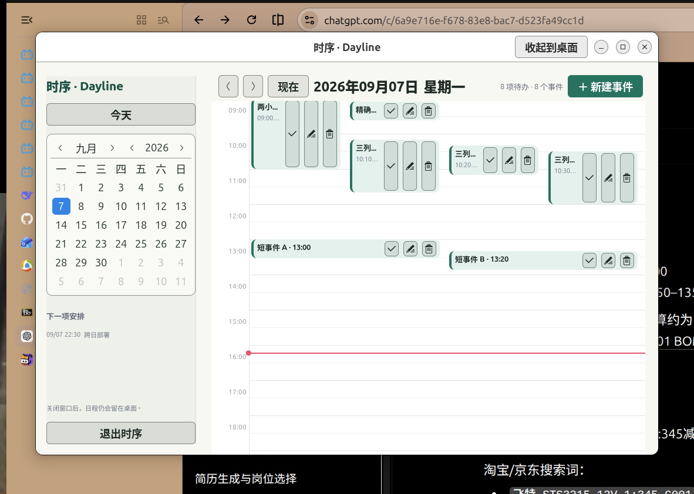

<div align="center">


# DayLine

**把今天的安排放回桌面。**

一款为 Ubuntu 24.04 打造的原生日程应用：Outlook 式日视图、桌面常驻卡片与可靠的到点提醒。

*A native, private and lightweight desktop calendar for Ubuntu.*

[](https://ubuntu.com/desktop)
[](https://www.python.org/)
[](https://www.gtk.org/)
[](#测试)
[](https://github.com/Higw2/ubuntu24-calendar/stargazers)

[快速安装](#安装) · [功能亮点](#功能亮点) · [桌面兼容性](#桌面兼容性) · [参与贡献](#参与贡献)

</div>



## 为什么是 DayLine？

很多日历适合“打开后查看”，DayLine 更关注日程如何融入 Ubuntu 桌面。主窗口用于规划，桌面卡片负责陪伴，提醒窗口确保重要安排不会被错过。

- **真正的日时间线**：事件按照开始分钟定位，卡片高度对应持续时间；重叠事件自动并排，跨午夜事件自动裁切。
- **桌面常驻卡片**：查看近期安排和实时时钟，无需反复打开主窗口；支持拖动、缩放，并记住位置和尺寸。
- **可靠提醒**：主窗口关闭后继续运行，到点同时显示应用内弹窗和系统通知；支持完成或延后 10 分钟。
- **按自己的风格显示**：8 种强调色、自由调色板、3 种桌面卡片主题和 4 档字体缩放，修改后立即生效。
- **本地优先**：日程和偏好设置只保存在本机，不需要账号、云服务或网络连接。
- **轻量原生**：Python + GTK4 + Libadwaita，无 Electron、无 npm、无额外 pip 依赖。

<table>
  <tr>
    <td width="46%" align="center"><strong>桌面日程卡片</strong></td>
    <td width="54%" align="center"><strong>主题与排版设置</strong></td>
  </tr>
  <tr>
    <td></td>
    <td></td>
  </tr>
</table>

## 功能亮点

### Outlook 式日视图

DayLine 使用连续 24 小时时间轴，而不是简单的待办列表。09:15 开始的事件会出现在 09:15，持续两小时的事件会覆盖两小时高度。当多个事件发生在同一时间段，它们会自动分列，仍然可以分别查看和操作。



### 一眼可见的桌面日程

点击“收起到桌面”，主窗口会隐藏，DayLine 继续显示近期安排并在后台检查提醒。

- 拖动顶部把手调整位置
- 拖动右下角调整卡片大小
- 自动保存位置和尺寸
- 顶部居中显示实时时钟
- 从卡片直接新建事件、打开主窗口或进入设置

### 事件与提醒

- 创建、编辑、删除和完成事件
- 支持备注、跨日事件和多个重叠事件
- 到点显示独立提醒弹窗和系统通知
- 支持“10 分钟后提醒”
- 提醒状态持久化，重启后不会重复弹出已处理提醒
- 恢复运行后补发 24 小时内错过的提醒

### 个性化

- 8 种预设强调色，也可以自由选色
- 深邃墨夜、跟随主题、清爽明亮三种桌面背景
- 90%、100%、115%、130% 四档字体大小
- 主窗口和桌面卡片实时同步更新

## 安装

### 1. 获取代码

```bash
git clone https://github.com/Higw2/ubuntu24-calendar.git
cd ubuntu24-calendar
```

### 2. 安装系统依赖

Ubuntu 24.04 通常已经包含其中大部分组件：

```bash
sudo apt update
sudo apt install python3 python3-gi python3-gi-cairo gir1.2-gtk-4.0 gir1.2-adw-1
```

### 3. 安装 DayLine

```bash
python3 install.py --autostart
```

安装完成后，在 Ubuntu 应用列表中搜索 **DayLine**。`--autostart` 会让桌面卡片在登录后自动出现；如果不需要自启动，运行 `python3 install.py` 即可。

安装只影响当前用户，不需要 `sudo`：

| 内容 | 位置 |
|---|---|
| 应用文件 | `~/.local/lib/dayline` |
| 启动器 | `~/.local/bin/dayline` |
| 日程数据库 | `~/.local/share/dayline/events.db` |
| 偏好设置 | `~/.config/dayline/settings.json` |
| 桌面卡片位置与尺寸 | `~/.config/dayline/desktop-position` |

## 直接运行

想先体验而不安装，可以在项目目录运行：

```bash
./run.sh
```

其他启动方式：

```bash
./run.sh --desktop   # 只显示桌面卡片
./run.sh --quit      # 退出正在运行的 DayLine
./run.sh --help      # 查看帮助
```

`run.sh` 会自动定位项目目录，因此可以从任意工作目录调用。

## 日常使用

1. 打开 DayLine，在左侧日历中选择日期。
2. 点击“新建事件”，填写名称、开始时间、结束时间和备注。
3. 在时间线上完成、编辑或删除事件。
4. 点击“收起到桌面”，让卡片留在桌面并继续接收提醒。
5. 按住卡片顶部拖动；使用右下角手柄调整大小。

关闭主窗口只会收起到桌面。若要停止后台提醒，请点击“退出 DayLine”或运行 `./run.sh --quit`。

## 桌面兼容性

| 会话 | 日程与提醒 | 桌面背景层 | 拖动与尺寸记忆 |
|---|---:|---:|---:|
| Ubuntu 24.04 GNOME X11 / Ubuntu on Xorg | ✅ | ✅ | ✅ |
| GNOME Wayland | ✅ | 普通常驻窗口 | 由窗口管理器控制 |

完整桌面模式目前以 **Ubuntu 24.04 GNOME X11** 为目标。X11 下，卡片会设置桌面窗口、置底、跨工作区并跳过任务栏和窗口切换器。

Wayland 不允许普通应用自行进入 GNOME 桌面背景层，因此 DayLine 会降级为普通窗口，日程和提醒仍可使用。如果需要完整桌面体验，可以在登录界面的齿轮菜单中选择 **Ubuntu on Xorg**。

## 数据与隐私

DayLine 不上传任何数据。事件保存在本地 SQLite 数据库中，主题、字体和桌面布局保存在本地配置文件中。

备份时先退出 DayLine，再复制：

```bash
cp ~/.local/share/dayline/events.db ~/dayline-events-backup.db
```

卸载应用：

```bash
python3 install.py --uninstall
```

卸载会移除应用文件、启动器和自启动项，同时保留日程数据库，避免误删用户数据。

## 测试

```bash
python3 -m unittest discover -s tests -v
python3 -m py_compile dayline/*.py tests/*.py install.py
```

当前测试覆盖事件存储、提醒状态、跨日裁切、分钟定位、重叠分列、短事件、主题生成、设置持久化及桌面窗口几何信息。当前版本共有 **27 项测试**。

详细的真实桌面验收记录见 [docs/ACCEPTANCE.md](docs/ACCEPTANCE.md)。

## 项目结构

```text
dayline/
├── ui.py               # 主窗口与事件编辑器
├── timeline.py         # 分钟级时间线和重叠布局
├── desktop.py          # 桌面卡片与 X11 集成
├── reminders.py        # 提醒调度与弹窗
├── storage.py          # SQLite 事件存储
├── settings.py         # 偏好设置持久化
├── settings_dialog.py  # 设置窗口
└── theme.py            # 动态主题生成
```

## Roadmap

- [ ] 周视图与月视图
- [ ] 重复事件
- [ ] `.ics` 导入与导出
- [ ] 提前 5/15/30 分钟提醒
- [ ] Flatpak / `.deb` 安装包
- [ ] Wayland 下的 GNOME Shell 扩展
- [ ] 更多语言

欢迎通过 [Issues](https://github.com/Higw2/ubuntu24-calendar/issues) 提交建议或报告问题，也欢迎直接发送 Pull Request。

## 参与贡献

```bash
git clone https://github.com/Higw2/ubuntu24-calendar.git
cd ubuntu24-calendar
git checkout -b feature/your-feature
```

提交前请运行测试，并在 Pull Request 中说明改动内容和验证方式。对于界面改动，附上前后截图会更容易评审。

---

<div align="center">

如果 DayLine 让你的 Ubuntu 桌面更好用，欢迎点一个 ⭐。你的 Star 会帮助更多人发现这个项目。

**Made for Ubuntu desktops with Python, GTK4 and Libadwaita.**

</div>
